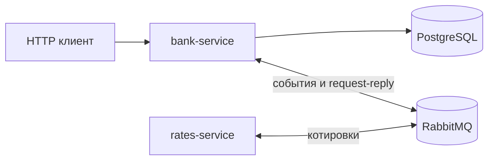

# Banking System

Банковский backend: пользователи, счета, история операций, комиссии и разграничение доступа. Отдельный сервис публикует демонстрационные валютные котировки через RabbitMQ. Баланс хранится в рублях; конвертация выполняется только при чтении.

## Возможности

- Администратор создаёт клиентов и администраторов, просматривает пользователей, счета и операции.
- Клиент открывает счета, пополняет и снимает средства, переводит деньги, управляет друзьями и читает свои данные.
- Комиссия перевода: между своими счетами — 0%, другу — 3%, остальным — 10%. Комиссия добавляется к списанию отправителя; получателю зачисляется указанная сумма.
- Денежные суммы положительные, не более двух десятичных знаков. Списание с комиссией округляется до копеек (`HALF_UP`). Перевод на тот же счёт запрещён.
- Изменения балансов и история сохраняются в одной транзакции. Изменяемые счета блокируются; при переводе порядок блокировок определяется UUID.
- Курсы USD/EUR/CNY поступают событиями. При отсутствии свежей котировки банк запрашивает её через RabbitMQ request-reply. Старые события не заменяют новые котировки.

## Стек и устройство

Java 25, Gradle Wrapper 9.2.0, Spring Boot 4.1.1, Spring Security, Hibernate/JPA, PostgreSQL 15, RabbitMQ 4, Springdoc OpenAPI, JUnit, Mockito, Testcontainers.

`bank-service`: `domain` → `application-abstractions` / `application-contracts` → `application`. Реализации репозиториев и транспорта находятся в `infrastructure`, HTTP и сборка приложения — в `presentation`. Прикладной слой обращается к интерфейсу `RateProvider` и не зависит от RabbitMQ.

`rates-service`: `application` генерирует котировки, `infrastructure` публикует события и отвечает на запросы, `presentation` запускает приложение. `shared` содержит внутренние контракты сообщений. У поставщика курсов нет HTTP API.



## Локальный запуск

Нужны JDK 25 и запущенный Docker с Compose. Java-приложения работают на хосте — из Gradle или IDE.

Из корня репозитория:

```sh
docker compose up -d --wait
./gradlew test
```

PostgreSQL доступен на `localhost:5434`, RabbitMQ — `localhost:5672`, интерфейс RabbitMQ — `http://localhost:15672` (`guest` / `guest`). Это настройки локальной демонстрации. Если эти порты заняты старой инфраструктурой, используйте другие порты и согласуйте адрес БД:

```sh
BANK_DB_PORT=15434 BANK_RABBIT_PORT=15673 BANK_RABBIT_MANAGEMENT_PORT=15674 docker compose up -d --wait
```

Для PostgreSQL создаётся отдельный том Compose-проекта. `database/init.sql` выполняется **только при инициализации пустого тома**; Hibernate затем проверяет схему через `ddl-auto: validate`. Скрипт не обновляет существующую БД. Автоматических миграций и автоматического удаления томов нет.

В первом терминале:

```sh
./gradlew :rates-service:presentation:bootRun
```

Во втором терминале задайте логин первого администратора и свой пароль длиной 12–30 символов, затем запустите банк:

```sh
export BANK_ADMIN_LOGIN=admin
# Задайте BANK_ADMIN_PASSWORD локально, не добавляя значение в Git.
./gradlew :bank-service:presentation:bootRun
```

При заданном `BANK_ADMIN_LOGIN` приложение создаёт администратора, только если такой логин ещё отсутствует. Пароль хешируется BCrypt. После первого запуска переменные bootstrap можно убрать; существующий пароль не перезаписывается.

Банк: `http://localhost:8080`. Войдите через `/login`, затем откройте `/swagger-ui/index.html`. Аутентификация сессионная (`JSESSIONID`), регистрация клиентов закрытая. Пример последовательности запросов — [docs/api-examples.md](docs/api-examples.md).

Для IDE импортируйте Gradle-проект, выберите JDK 25 и запускайте `runners.App` с classpath соответствующего `presentation`-модуля. Не объединяйте classpath двух сервисов: у них есть одноимённые пакеты и классы конфигурации.

Остановка инфраструктуры с сохранением данных:

```sh
docker compose stop
```

### Настройки

| Переменная | Значение по умолчанию | Назначение |
|---|---|---|
| `BANK_DB_URL` | `jdbc:postgresql://localhost:5434/banks_lab` | JDBC URL банка |
| `BANK_DB_USER` / `BANK_DB_PASSWORD` | `banks_user` / `banks_password` | Локальная БД |
| `BANK_RABBIT_HOST` / `BANK_RABBIT_PORT` | `localhost` / `5672` | Брокер обоих сервисов |
| `BANK_RABBIT_USER` / `BANK_RABBIT_PASSWORD` | `guest` / `guest` | Учётная запись брокера |
| `BANK_PORT` | `8080` | HTTP-порт банка |
| `RATES_CACHE_TTL` | `30s` | Срок актуальности котировки в банке |
| `RATES_REPLY_TIMEOUT` | `3s` | Ожидание ответа поставщика |
| `RATES_PUBLISH_INTERVAL` | `10s` | Период публикации курсов |

## Проверки

```sh
./gradlew test                 # unit и HTTP/security-тесты без Docker
./gradlew build -Pintegration  # также PostgreSQL и RabbitMQ в Testcontainers
python3 scripts/smoke.py       # два собранных приложения и новая временная БД (нужен Python 3)
```

Интеграционные тесты создают собственные контейнеры со случайными портами и не используют локальную БД. Проверяются сохранение переводов, откат при ошибке второй записи истории, параллельные пополнения и встречные переводы, сообщения RabbitMQ и недоступность поставщика. В брокерных тестах банка поставщик ответов — тестовый компонент; реальный `rates-service` проверяется отдельно и при проверке запуска двух приложений.

CI выполняет сборку и интеграционные тесты. [Изменения поведения и сохранённые сценарии](docs/behavior.md).

## Ограничения

Курсы синтетические и не предназначены для финансовых расчётов. Конвертируется текущий баланс, исторические операции возвращаются в рублях. Очередь событий рассчитана на один экземпляр банка, кэш — в памяти. Часы сервисов должны быть синхронизированы: котировки из будущего не принимаются. Нет платёжных интеграций, ledger учёта комиссий, идемпотентных ключей операций и автоматических миграций.

Сохранён локальный сессионный режим исходного приложения с отключённой CSRF-защитой. Это демонстрационный запуск, не конфигурация публичного банковского сервиса.

Исторические этапы сохранены в тегах `course/lab-2` … `course/lab-5`. README и команды выше относятся к актуальному `main`.
